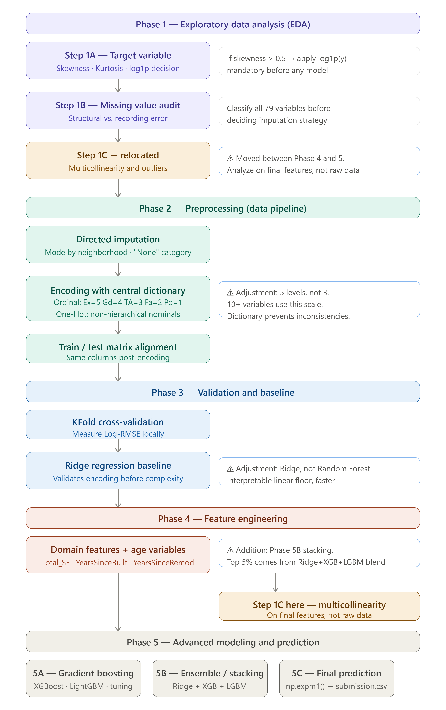
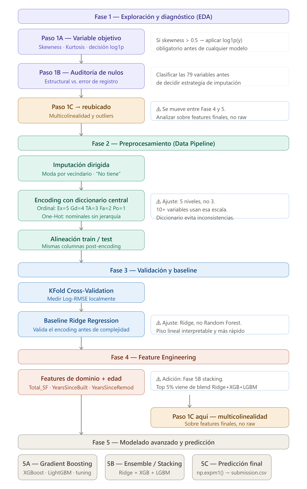

# House Prices: Advanced Regression Techniques

Data science project developed for the Kaggle competition, focused on predicting housing prices in Ames, Iowa, using advanced regression techniques.

## Tech Stack
This project leverages the following stack to ensure robust data processing and high-performance modeling:

* **Language:** Python 3.14
* **Core Data Manipulation:** Pandas, NumPy
* **Visualization:** Matplotlib, Seaborn
* **Modeling & ML:** Scikit-Learn (Ridge, Stacking), XGBoost, LightGBM
* **Environment:** Kaggle Kernels (Jupyter Notebooks)

## Project Roadmap / Roadmap del Proyecto

## Methodology

* **Phase 1 (Exploration):** Diagnostic of skewness in the target variable (applying log1p) and null data audit to define imputation strategies.

* **Phase 2 (Preprocessing):** Creation of a centralized Encoding Dictionary to ensure consistency between ordinal and nominal variables, ensuring exact alignment between train and test sets.

* **Phase 3 (Baseline):** Establishment of a performance floor using Ridge Regression validated with K-Fold Cross-Validation.

* **Phase 4 (Feature Engineering):** Creation of domain-specific variables (Total_SF, YearsSinceBuilt, YearsSinceRemod) and critical analysis of **multicollinearity**.

* ,**Phase 5 (Advanced Modeling):** Implementation of a Stacking Regressor (Ensemble) combining Ridge, XGBoost, and LightGBM.

## Results 

* **Local RMSE (K-Fold): 0.1113**

* **Public Leaderboard Score: 0.12519**

## License

This project is under the MIT license. 

--------------------------------------------------------------------------------------------------------------------------------------------

# House Prices: Técnicas de Regresión Avanzada (Versión en español)

Proyecto de ciencia de datos desarrollado para la competencia de Kaggle, enfocado en la predicción de precios de viviendas en Ames, Iowa, mediante técnicas de regresión avanzada.

## Roadmap del Proyecto

## Metodología

* **Fase 1 (Exploración):** Diagnóstico de skewness en la variable objetivo (aplicando log1p) y auditoría de datos nulos para definir estrategias de imputación.

* **Fase 2 (Preprocesamiento):** Creación de un Diccionario de Encoding centralizado para garantizar consistencia entre las variables ordinales y nominales, asegurando la alineación exacta entre train y test.

* **Fase 3 (Baseline):** Establecimiento de un *floor* de rendimiento mediante Ridge Regression validado con K-Fold Cross-Validation.

* **Fase 4 (Ingeniería de Características):** Creación de variables de dominio (Total_SF, YearsSinceBuilt, YearsSinceRemod) y análisis crítico de **multicolinealidad**. 
    
* **Fase 5 (Modelado Avanzado):** Implementación de un Stacking Regressor (Ensemble) que combina Ridge, XGBoost y LightGBM.

## Resultados

* **Local RMSE (K-Fold): 0.1113**

* **Public Leaderboard Score: 0.12519**

## Licencia

Este proyecto está bajo la licencia MIT.
